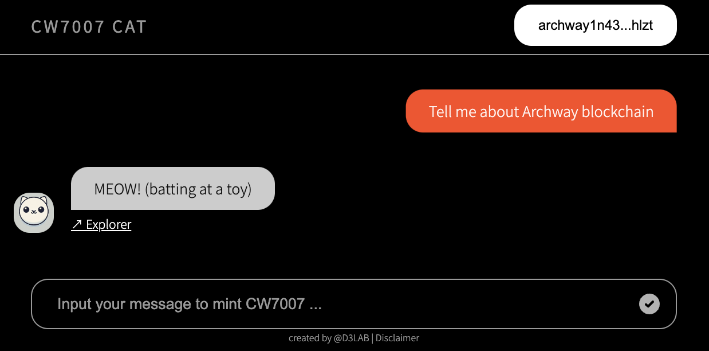

# CW7007 MEOW



## Overview

The CW7007-MEOW webapp is a comprehensive solution designed to facilitate the use case of [CW7007](https://github.com/D3LAB-DAO/cw7007), a token standard for verifiable AI-generated content tokens.

## Usage

```bash
$ npm run build && npm run deploy
```

After deploying the application, you can access it through your web browser.

🔗 [https://d3lab-dao.github.io/cw7007-webapp/](https://d3lab-dao.github.io/cw7007-webapp/)

<!-- 
# TODO
- history (per account)
-->
